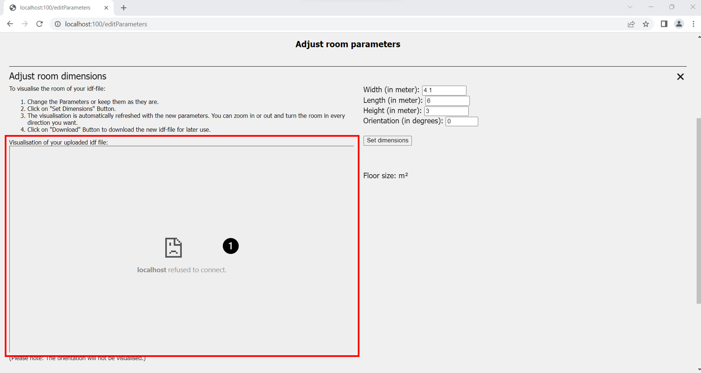

(Author: Philipp Bogdain)
# Error Management

This part of the documentation is dedicated to the error management.  
The Code is supposed to catch most errors and either solve it or at least return a proper message to the User.  
The following tables consists of known errors with a possible solution.

### EnergyPlus Error:
The simulation was started, but EnergyPlus ran into an exception. An error file is automatically generated by "eppy" in the output folder and can be opened with a text viewer. This file is saved in the project folder in the sub directory "./backend/eppy_output/" and is called "eplusout.err". The file is structered by severness. In this case the message labeled "Fatal" is most important.  
Note: The different messages overlap sometimes, giving more information about the error.

#### Leap Day

Once in a while, february is 29 days long. EnergyPlus has problems simulating only this day.  
- Occurence: run period defined for only the leap day (e.g.: 2024-02-29 - 2024-02-29)  
- Solution: simulate the 28th and the 29th of february, both days are calculated properly

Example eplusout.err error file for this example:
```
    ** Severe  ** Multiple rewinds on EPW while searching for first day 2/29
    **  Fatal  ** Error occurred on EPW while searching for first day, stopped at 1991/12/31 1:0 IO Error='no error'
```

### Frontend
A major part in the frontend is the visualization of the room.  
The open-source project ["Ladybug Spider"](http://www.ladybug.tools/spider-2021/spider-2021-11-02.html) is integrated and running on a Node.js Server.  


Figure 1 shows the case where an error occurred during startup of the server (marking 1).  
There are multiple possible error sources:
- Server is not running
- Node.js is not installed
- Network port is allocated to another program  

To see if the server is running, check the open command consoles. One of them should be dedicated to the visualization.  
A typical reason for the console to close is the second point in the list. The server is started by calling the node server.  
Without the installation an error is thrown, and the console is closed immediately. Check the Node.js installation.  
Another explanation for the visualization not to work lies in the connection between frontend and the visualization program.  
The Node.js Server is running on port 50715. It is possible that the port is already allocated to another program. In this case it is not possible to switch port without changing the programming. Try closing the other program if the visualization is of immediate importance.
Use the browser of your choice to find out how to look up, which ports are in use for your operating system.

#### Port allocation
While it is not possible for the user to easily change the port of the visualization server, it is for the other parts of the program. In the front- and backend are config files, where the port is defined for these two parts.  

File path: ./frontend/frontend_config.ini
```
[Frontend]
IP = 127.0.0.1
Port = 100

[Backend]
Address = localhost
Port = 5000
```

In this file the port for the front- and backend can be changed.  

The last port used is for the Docker container running MongoDB. It is configured to be on 27017.
It is not recommended to change it, but in case there is the need, the following steps are required:
1. Delete the old Docker container if one exists
2. Change port in the docker container / Alternative: change the parameters in the "./installation.bat" (Windows) or "./installation.sh" (Linux) files.  

From:
```
docker run --name simulation_db -p 27017:27017 -d mongo:6.0.2
```
To the desired port:
```
docker run --name simulation_db -p <port>:<port> -d mongo:6.0.2
```
3. Change the path in the backend config file. (./backend/config.ini)
```
[MongoDB]
connection_string = mongodb://localhost:<port>
``` 


### Backend:
Many control instances for the uploaded data are integrated into the frontend. Thus, using only the REST-API to interact with the backend requires extra careful verification of the parameters.
- Run Period:
    - Both days are not validated for consistency
    - Endday equal or after the start day
    - Duration of the runperiod:
        - Equal or less than 1 year
        - Start year and end year always need to be equal
- Files:
    - File consistency is not checked
        - IDF-file: structure and necessary elements are not previosly checked
        - CSV-file: 
            - file structure: day\|time\|occupants\|win1
            - file length: (rows % 1440) = 1
            - time coloumn format: HH:MM:SS
    - File encoded
    - File size does not exceed 16 megabytes (encoded!)
- Results: ESO-file format
