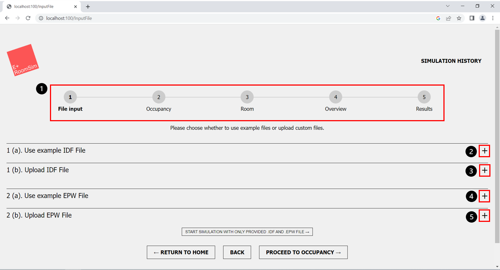
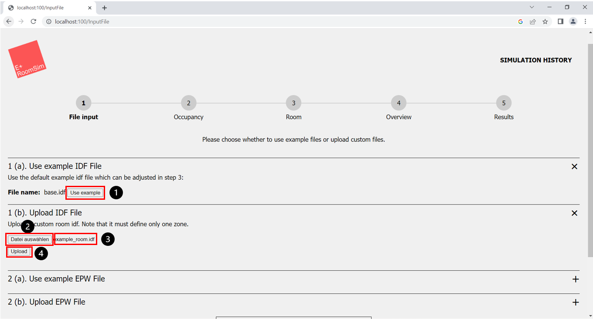
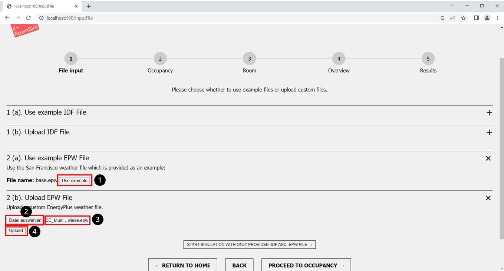
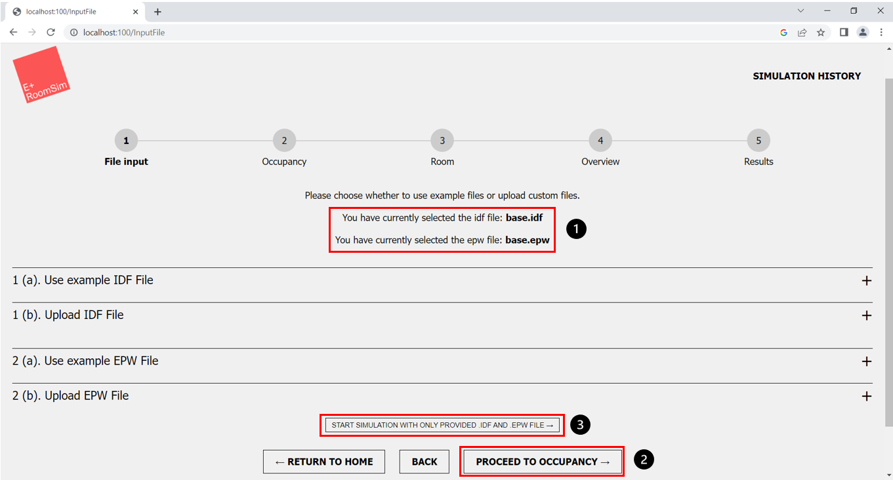
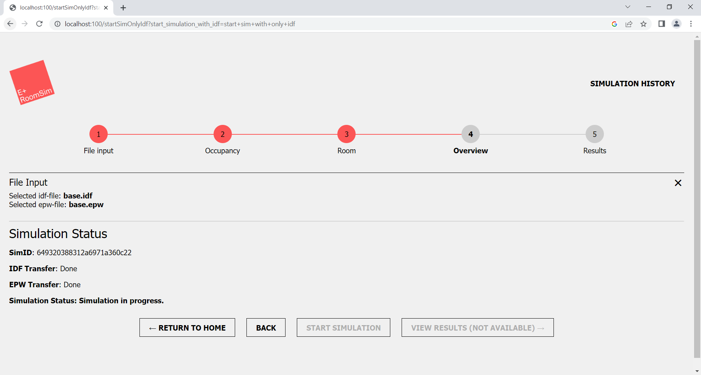

Author: Sophia Weißenberger
# File Input

*Figure 1: File Input*

1. Steps in the Simulation Process
2. "+" button, to open "Use example IDF File" segment
3. "+" button, to open "Upload IDF File" segment
4. "+" button, to open "Use example EPW File" segment
5. "+" button, to open "Upload EPW File" segment

After starting a new simulation you will be redirected to the "File Input" page. Here you can see the steps of the simulation process for the first time (Fig. 1, marker 1). Currently you are in the step "File input". On this page you need to upload all necessary IDF and EPW files for the simulation. Here is a short overview of the two file types:

## IDF files

IDF files are the core of every EnergyPlus simulation. The simulation is primarily based on the information within this file. A IDF file is mandatory for a simulation. The file contains information about the global location, the room geometry, specific information about the building and the presence of people in the simulated room (in the following called "Occupancy").

In the GUI you have two options to provide a suitable IDF file for the simulation.

### Step-by-step instructions for choosing the required IDF file

*Figure 2: File Input - open IDF section*

1. "Use example" button
2. "Datei auswählen"/ "Select File" button
3. Name of the chosen file
4. "Upload" button

You have two options to provide a suitable IDF file for the simulation:

1. (Option A) Use an example IDF file (base.idf) via the GUI (Fig. 1, marker 2).
Note: The IDF file is based on a generic IDF file, which can be further modified via the web interface.
2. (Option B) Uploading a custom IDF file via the GUI (Fig. 1, marker 3).

   * (Option A) Using a provided example IDF file  
      * Click on the "+" button in the line 'Use example IDF file' (Fig. 1, marker 2).
      * Press the 'Use example' button (Fig. 2, marker 1).
      * If successful, the name "base.idf" will now be displayed in the web interface (Fig. 4, marker 1).
   * (Option B) Upload your own IDF file
      * Click on the "+" in the line 'Upload IDF file' (Fig. 1, marker 3).
      * Click on the 'Select file' or 'Datei auswählen' button (Fig. 2, marker 2).
      * In the Explorer window that opens, choose your desired file.
      * If successful, the name of your file should be displayed in the field next to the button (Fig. 2, marker 3).
      * Then click on the 'Upload' button (Fig. 2, marker 4). Important: Your file will be uploaded only after clicking this button.
      * After a successful upload, the name of the uploaded file is now displayed in the the web interface (Fig. 4, marker 1).
   * Deleting an existing IDF file
      * If you want to remove an uploaded file, you can not delete it. You can choose a new file and the old file will be overwritten.
      

## EPW files

EPW files (short for "EnergyPlus Weather Data File") are EnergyPlus-specific weather files. EPW files are the main data source of the simulation regarding the the simulation of an outdoor climate. A EPW file is mandatory for a simulation.

EPW files contain time series with different authentic climate data measured at a certain location. The EPW file for the simulation must be uploaded in the GUI.

If you do not have access to weather data in EPW format, we refer you to following resources:
   * [https://energyplus.net/weather](https://energyplus.net/weather) - A weather data service from EnergyPlus, which provides EPW data for about 3000 locations.
   * [https://bigladdersoftware.com/projects/elements/](https://bigladdersoftware.com/projects/elements/) - A software to create and convert existing weather data into the appropriate EPW format.

### Step-by-step instructions for choosing the required EPW file

*Figure 3: File Input - open EPW section*

1. "Use example" button
2. "Datei auswählen"/ "Select File" button
3. Name of the chosen file
4. "Upload" button

You have two options to provide a suitable EPW file for the simulation:

1. (Option A) Use an example EPW file (base.epw) via the GUI (Fig. 1, marker 4).
2. (Option B) Uploading a custom EPW file via the GUI (Fig. 1, marker 5).

   * (Option A) Using a provided example EPW file  
      * Click on the "+" button in the line 'Use example EPW file' (Fig. 1, marker 4).
      * Press the 'Use example' button (Fig. 3, marker 1).
      * If successful, the name "base.epw" will now be displayed in the web interface (Fig. 4, marker 1).
   * (Option B) Upload your own EPW file
      * Click on the "+" in the line 'Upload EPW file' (Fig. 1, marker 5).
      * Click on the 'Select file' or 'Datei auswählen' button (Fig. 3, marker 2).
      * In the Explorer window that opened, choose your desired file.
      * If successful, the name of your file should be displayed in the field next to the button (Fig. 3, marker 3).
      * Then click on the 'Upload' button (Fig. 3, marker 4). Important: Your file will be uploaded only after clicking this button.
      * After a successful upload, the name of the uploaded file is now displayed in the the web interface (Fig. 4, marker 1).
   * Deleting an existing EPW file
      * If you want to remove an uploaded file, you can not delete it. You can choose a new file and the old file will be overwritten.

## Proceed or use optional feature: Run simulation only via IDF & EPW file

After successfully uploading the IDF and EPW files (Fig. 4, marker 1), there are two ways to proceed. 

1. Proceed to the next step with the "Proceed to occupancy" button and configure further settings for the simulation (Fig. 4, marker 2). 
2. With the "Start simulation with only provided idf and epw file" button you can skip the remaining steps and jump directly to the step where you can start the simulation without having to make any further configurations (Fig. 4, marker 3).

*Figure 4: File Input - Successful upload*

1. Uploaded files
2. "Proceed to occupancy" button, to proceed to the next step
3. "Start simulation with only provided idf and epw file" button, to skip further steps

If you choose "Start simulation with only provided idf and epw file" you will be send to the step seen in the following picture and you can start the simulation without further need for configurations (Fig. 5).

*Figure 5: Overview simulation with only an idf and epw file*

