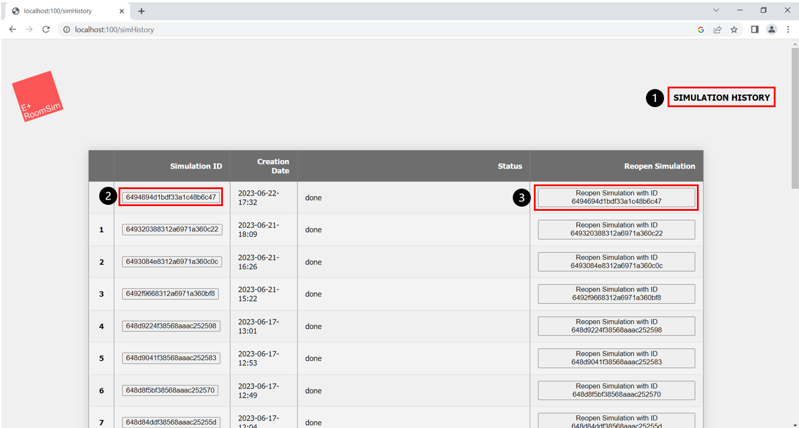
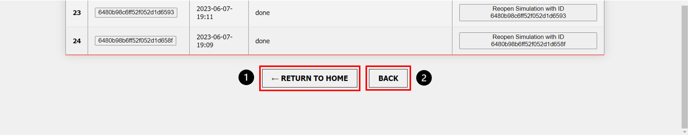
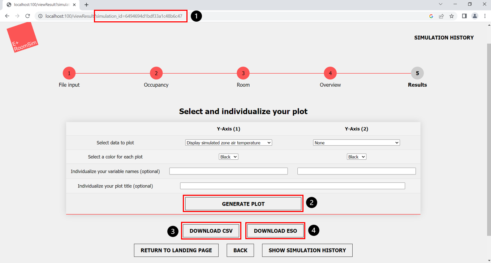
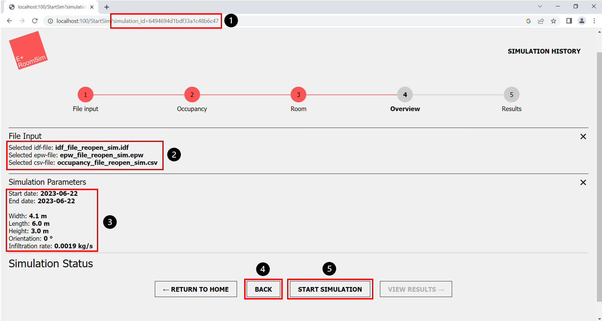

(Author: Sophia Weißenberger) 
# Simulation History

In the simulation history you can get an overview of the simulations performed so far. You can access this page from every step in the simulation process with the "Simulation History" button (Fig. 1, marker 1). In the simulation history table the individual simulation ID and the creation date of the individual simulations are displayed. Furthermore you can see the status of the simulation.

1. "Simulation History" button, to open this page (possible from every simulation step)
2. Button to reopen results of previously run simulation, corresponding to the simulation ID
3. Button to reopen previously run simulation, corresponding to the simulation ID

You can return to the start page of the program either via the logo in the upper right corner or via the button "Return to Home" (below the displayed table) (Fig. 2, marker 1) to return to the start page. If you want to go to the previous step, you can use the "Back" button (Fig. 2, marker 2).

1. "Return to Home" button
2. "Back" button, to navigate to the previous process step
   
# Reopen and redownload previous simulation results

We offer you the feature to reopen the simulation results of a previous run simulation in the frontend. This allows you to easily visualize the results again in a plot or download the results as csv-file or eso-file. If you want to use this functionality, click on the button with the simulation ID of the simulation for which you want to open the results again (Fig. 1, marker 2).

1. Reopend results for the simulation with this ID
2. "Generate Plot" button, to generate a plot visualisation of the simulation results
3. "Download CSV" button, to download simulation results as csv-file 
4. "Download ESO" button, to download simulation results as eso-file 

You will be redirected to the results page. You can see by the ID in the url that these are the results for the selected simulation (Fig. 3, marker 1). Now you can visualize the simulation results in a plot (Fig. 3, marker 2) or download the results as csv-file (Fig. 3, marker 3) or eso-file (Fig. 3, marker 4). 

# Reopen an old simulation to change parameters and run again

We also offer you the feature to reopen a previous run simulation in the frontend to change files or configurations and run the simulation again, without having to upload all the files again or reentering all the configurations. If you want to use this functionality, click on the "Reopen Simulation with ID" button (Fig. 1, marker 3) with the simulation ID of the simulation you want to open again.

1. Reopend simulation for the simulation with this ID
2. File input information
3. Simulation Parameters information
4. "Back" button, to navigate to the process step where you want to change something
5. "Start Simulation" button, to restart simulation

You will be redirected to the start simulation step. You can see by the ID in the url that these are the results for the selected simulation (Fig. 4, marker 1). You can see the files (Fig. 4, marker 2) and configurations (Fig. 4, marker 3) used for that simulation. You have the option to navigate through the steps and change files or configurations via the "back" button (Fig. 4, marker 4). You can restart the simulation via the "start simulation" button (Fig. 4, marker 5).
