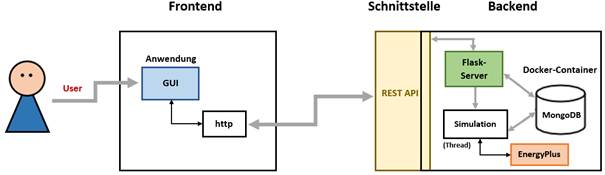

(Author: Diana) 
# Introduction

This documentation provides you with information for the programm Indoor Climate Simulation. This programm simulates the concentration of CO2 in rooms. For the simulation the program "EnergyPlus" is used. Additionaly the Python Package "eppy" serves as a connector between EnergyPlus and Python.  

This programm consists of two part, the frontend and the backend. The Frontend includes a web server with a GUI to control the simulation. The backend includes the simualtion via "eppy". Data of the simulations will be saved in a MongoDB and the backend provides additional functionalities with a REST API. 




# Installation

Requirements to install the software Indoor Climate Simulation

* Installation of Python 3.10
* Installation of EnergyPlus (Version 22-2-0)
* Current Version of Docker
* Windows or Linux

## Note 
Das Skript führt entweder eine komplette Installation oder lediglich einen Start der 
Ressourcen und des Programms durch. Die komplette Installation beinhaltet das Erstellen 
eines virtuellen Python VENV Environments, das Herunterladen und Starten des MongoDB 
Images und Containers, das Installieren aller benötigten Python Packages und das Starten 
von Frontend und Backend. Das bloße Starten beinhaltet das Starten des bestehenden 
MongoDB Docker Containers und des Programms. Wichtig ist hierbei: Für eine komplette 
Installation wird auf ein Systempfad auf Gleichheit überprüft. Diese Prüfung ist nur dann 
erfolgreich, wenn kein virtuelles Environment aktiviert ist. Um eine komplett frische 
Installation durchzuführen, müssen also alle bestehenden, aktuell aktivierten virtuellen
Umgebungen deaktiviert werden. Für einen bloßen Start der Programme (falls eine 
Installation bereits durchgeführt wurde) muss hingegen vor dem Start des Skripts das 
dedizierte, von der Installation kreierte VENV manuell aktiviert werden.

## Instructions

Um die Software erstmalig zu installieren, muss das Skript „install.py“ im Ordner 
raumklimadaten-simulation-a1 mit dem Befehl „python install.py“ aufgerufen werden. 
Dabei muss sich der Anwender im Projektordner befinden und dieses Skript nicht von 
über/untergeordneten Ordnern aufrufen. Das Skript erstellt mithilfe von .bat Dateien und 
unter Nutzung der Windows Befehlsaufforderung anschließend ein VENV mit dem Namen 
„raumklimadaten-a1“ und aktiviert dieses. Anschließend werden alle benötigten Packages 
mit pip in das virtuelle Environment installiert. Sind diese Schritte abgeschlossen, wird das 
Docker-Image „mongo“ in der Version 6.0.2 von Docker-Hub heruntergeladen. Nach 
Abschluss des Downloads wird ein Docker-Container mit diesem Image mit dem Namen 
„raumklima_db“ erstellt. Sind diese Schritte abgeschlossen, wird das Frontend und Backend 
gestartet. Am Ende der kompletten Installation sollten zwei cmd-Shells geöffnet sein, in welchen die beiden Programmteile ablaufen. Unter dem Port localhost:100 sollte die 
Benutzeroberfläche erreichbar und nutzbar sein. 
Um die Software nach erfolgter Installation lediglich zu starten, muss ebenfalls in den 
Projektordner gewechselt werden. Anschließend muss sichergestellt werden, dass das VENV 
„raumklimadaten-simulation-a1“ aktiviert ist, bevor erneut das Skript „install.py“ 
aufgerufen wird. Das Skript wird dann lediglich den erstellten Container „raumklima_db“ 
und sowohl Frontend als auch Backend starten. Das Programm sollte anschließend ohne 
eine komplette Neuinstallation verwendbar sein. 
Nach der Installation oder des erneuten Starts des Programms sollten zwei Python 
Applikationen und ein MongoDB Docker Container auf der Maschine laufen. Port 100 und 
5000 sollten von der Software selbst blockiert sein. Auf Port 100 läuft das auf dem 
Framework Flask basierende Frontend, während auf Port 5000 die ebenfalls auf Flask 
basierende REST API auf Anfragen wartet. Der MongoDB Container blockiert ebenfalls einen 
Port, welcher jedoch nicht fest von den Programmierern vorgegeben ist.

## Error Management

Das Programm ist in der Lage sein, alle erwarteten und gängigen Fehler ordentlich zu 
bearbeiten. Sollten im Frontend Fehlerzustände auftreten, so wird der Nutzer über eine 
Meldung auf der GUI informiert. Sollte es im Backend zu Fehlern kommen, so wird eine 
Fehlermeldung in der Konsole ausgegeben, in welcher das Backend läuft. Fehler, welche mit 
einer konkreten und leicht verständlichen Fehlermeldung in der Konsole ausgegeben 
werden, führen nicht zum Absturz des Backends. Tritt allerdings ein unerwarteter Fehler 
auf, so würde dies zum kompletten Absturz des Backends führen. In diesem Fall müsste das 
Programm neu gestartet werden. 

## Memory

Input

Um Simulationen mit EnergyPlus durchzuführen, werden einige Daten benötigt. Konkret 
handelt es sich um eine .idf Datei, eine .csv Datei der Occupancy und um einige benötigte 
Metadaten wie Startdatum, Enddatum, Infiltrationsrate, Raum und Fenstermaße. All diese 
Daten werden persistent in der MongoDB Collection simulation-input gespeichert. Diese 
Einträge werden dabei noch mit einem Filename und einem Zeitstempel versehen, welcher 
ebenfalls gespeichert wird. 


Output

Das Programm führt EnergyPlus Simulationen durch. Ergebnisse solcher Simulationen sind 
einige Output-Dateien von EnergyPlus. Diese werden im Projektordner im eppy-output 
Verzeichnis abgelegt, wobei diese bei jedem Simulationslauf überschrieben werden. Die für 
die Simulation genutzten .idf Dateien sind hiervon nicht übertroffen. Diese werden mit 
einem tag versehen und dauerhaft im Ordner gespeichert. Die wichtigste Datei, die .eso Datei 
wird mit einem tag versehen und im Ordner „eso-output“ abgelegt. Diese werden nicht 
überschrieben, was bedeutet, dass mit jeder erfolgreichen Simulation eine weitere .eso Datei 
in diesem Ordner erstellt wird. Die zur Simulation genutzte .idf und die .csv Datei werden 
hingegeben persistent in der MongoDB Collection „simulation-output“ gespeichert. Auch 
hier wird ebenfalls ein Zeitstempel, sowie ein Filename zusätzlich zu den oben genannten 
Daten gespeichert.

## Installation with Linux

Für die Installation unter Linux gibt es ein paar Eigenheiten zu beachten. Die .bat Skripte 
sind unter Linux nicht ausführbar. Dafür werden extra Shell-Skripte mit der Endung „.sh“ 
bereitgestellt. Die Installation Erfolg mit diesen Skripten analog zu den Bash-Skripten. Zum 
Starten des Backend muss allerdings die config.ini im Backend-Verzeichnis angepasst 
werden. Im Folgenden ist die Beispiel-Konfiguration in der EnergyPlus im /opt/ Verzeichnis 
installiert wurde.

```
[EnergyPlus]
EplusPath = /opt/EnergyPlus-22.2.0
iddPath = /opt/EnergyPlus-22.2.0/Energy+.idd
```

Erfolgt die Installation auf einem Server und soll von Clients erreichbar sein, muss außerdem 
die frontend_config.ini im Frontend-Verzeichnis angepasst werden.

```
[Frontend]
IP = 0.0.0.0
Port = 80
```

Durch die eingestellt IP-Adresse 0.0.0.0 läuft der Webserver auf allen verfügbaren Netzwerk Adaptern. Oft sind innerhalb eines Netzwerks nur wenige Ports durch die Firewall 
zugelassen. Standardmäßig ist im Frontend der Port 100 konfiguriert, da dieser kein 
Standard ist und daher oft blockiert wird, empfiehlt es sich den Port auf den Standard http Port 80 zu ändern.
Für die genauer Abfolge der Befehle um die komplette Anwendung, sowie EnergyPlus unter 
Linux zu installieren bitte die README.md Datei des Projekts beachten.


# Parametrisierung & Konfiguration

Die Konfiguration der wichtigsten Softwareparameter für das Backend kann in der config.ini, 
welche sich im Ordner „raumklimadaten-simulation-a1/backend“ befindet, vorgenommen 
werden. Folgende Parameter können eingestellt werden:

| Parameter | Beschreibung | Bereich |
|----------|----------|----------|
|EplusPath|Pfad zur EnergyPlus Installation auf der lokalen Maschine. Dieser Pfad muss hier angegeben werden. Beispiel: C:/EnergyPlusV22-2-0| EnergyPlus
|iddPath|Pfad zur .idd Datei von EnergyPlus. Dieser Pfad muss angegeben werden, um Simulationen starten zu können. Der Pfad muss hierbei in den Ordner der EnergyPlus Installation führen. Idd-Files, welche in anderen Verzeichnissen liegen, werden zu Fehlermeldungen führen. Beispiel: C:/EnergyPlusV22-2-0/Energy+.idd|EnergyPlus|
|idfZone|Die zu nutzende Zone innerhalb einer .idf Datei. Dieser Wert liegt standardmäßig bei „RL_Office_27214585“. Dieser Wert basiert auf dem Standard-IDF Gebäude3.idf. Wird ein komplett eigenes .idf genutzt und nicht nur Raum und Fenstermaße angepasst, so muss dieser Name entsprechend vom Admin geändert werden. Beispiel: RL_OFFICE-27214585|EnergyPlus|
|co2OutdoorValue|Ergebnis der WarmUp Simulation. Parameter gibt die Ausgangs Co2 Werte an, welche beim Start einer Simulation bereits gelten sollen. Angabe des Wertes im ppm. Standardmäßig auf 437 eingestellt. Wird benötigt, um Plots der Co2 Werte erstellen zu können.Beispiel: 437|EnergyPlus|
|co2GenerationRate|Zugrundeliegende Standard-Co2 Generationsrate. Standardmäßig auf 0.0000000382 eingestellt. Beispiel: 0.0000000382|EnergyPlus|
|ActivityLevel|Das Aktivitätslevel möglicher vorhandener Personen in einer Simulation. Basiert auf der American Society of Heating, Refrigerating and Air-Conditioning (ANSHRAE) des American National Standard Institutes (ANSI). Aktivitätslevel beschreiben in Tätigkeiten einer Person und die damit verbundenen Generationsraten von Co2 in einem Raum. Tabelle ersichtlich in ANSI/ASHRAE 55-2010. Standardmäßig auf 108 (Mischung aus 55 % Lesen, 40% Tippen, 3% Ablage sitzend und 2% Umhergehen) eingestellt. Beispiel: 108|EnergyPlus|
|OutputDirectoryName|Name des zu erstellenden und zu nutzenden Output Directorys für Output-EnergyPlus Files. Standardmäßig auf „eppy_output“ eingestellt. Beispiel: eppy_output|EnergyPlus|
|Connection_String|Pfad, um sich mit der Raumklima MongoDB zu verbinden. Standardmäßig auf Port der Standardinstallation mit Docker eingestellt. Der lokal verfügbare Container Port muss angegeben werden. Das vorgeschaltete „mongodb://“ wird immer benötigt und sollte nach nicht abgeändert werden. Beispiel: mongodb://localhost:27017|MongoDB|


Die Konfiguration der Parameter für das Frontend werden in der frontend_config.ini 
vorgenommen. Diese Datei befindet sich im Ordner „„raumklimadaten-simulation-a1/frontend


|Parameter|Beschreibung|Bereich|
|-|-|-|
|IP|Die IP Adresse unter der das Frontend erreichbar ist. |Frontend|
|Port|Der Port unter dem das Frontend erreichbar ist. |Frontend|
|Adress|Die Adresse unter der das Frontend mit dem Backend kommunizieren kann. |Backend|
|Port|Der Port unter dem das Frontend mit dem Backend kommunizieren kann|Backend|
|Zone|Dieser Wert liegt standardmäßig bei „RL_Office_27214585“. Dieser Wert basiert auf dem Standard-IDF Gebäude3.idf. Wird ein komplett eigenes .idf genutzt und nicht nur Raum und Fenstermaße angepasst, so muss dieser Name entsprechend vom Admin geändert werden. |Simulation|


