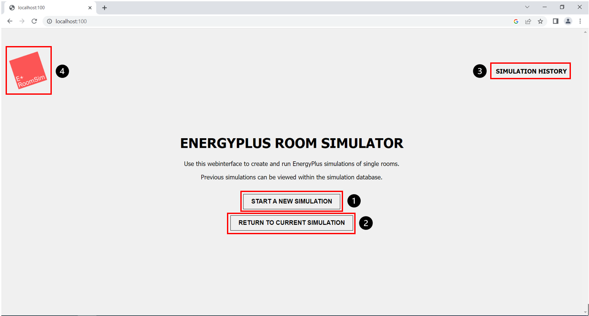

(Author: Sophia Weißenberger) 
# New Simulation

Once you launch the application and open [http://localhost:100/](http://localhost:100/) in your browser. You will be taken to the Home screen shown in Fig. 1.

1. "Start Simulation" button 
2. "Return to current simulation" button
3. "Simulation History" button
4. "Logo - Return to Home Screen" button

Now you can either start a new simulation (Fig. 1, marker 1), or, if available, continue with the configuration of an already started simulation. (Fig. 1, marker 2). The latter option will only be displayed if there is already a simulation to work on that can be continued. In addition, you can use the button in the upper right corner of the screen (Fig. 1, marker 3), to go to the "Simulation History". The "Simulation History" is an overview of the simulations that have already been run successfully or run into an error. You can use the logo button of the tool in the upper left corner (Fig. 1, marker 4) to return to this page from everywhere in the frontend.
