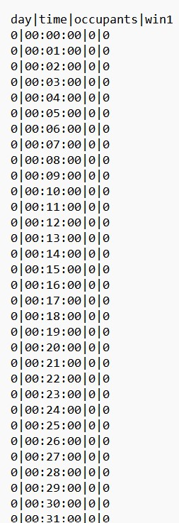

(Author: Katharina Sammet) 
# Occupancy

|example files|
|-|
|[Empty occupancy file for 1 day](https://github.com/KathiSa/indoorclimatesimulation/blob/main/resources/Base_OCP.csv)|
|[Example occupancy file for 1 day](https://github.com/KathiSa/indoorclimatesimulation/blob/main/resources/occupancy_1day.csv)|
|[Example occupancy file for 7 days](https://github.com/KathiSa/indoorclimatesimulation/blob/main/resources/occupancy_7days.csv)|

## Occupancy settings

*Figure 1: occupancy start page*

1. "Return to home" This Button will redirect to the landing page
2. "Back" This button goes back to the previous page "File Input"
3. "Proceed to simulation Parameters" Redirects to the next page "Room" (only if timeframe and occupancy file are uploaded)

After the idf and epw file are uploaded the next step is to create a timeframe and upload an occupancy of the room. This page let the user set the timeframe and a create or upload a file with occupany information. With the buttons on the bottom is is possible to navigate to the previous page, back to the landing page and proceed to the next page. To proceed to the next page, the simulation room parameter page, all information on this site need to be uploaded or created. If the timeframe or file is missing it is not possible to proceed to the next site. 

## Set timeframe

*Figure 2: occupancy - set timeframe*

1. "Start date":  Set start date for the simulation
2. "End date": Set end date for the simulation
3. "Enter time frame":  Saves timeframe

Here the user needs to enter a timeframe for the simulation. Be aware that the timeframe should match the occupancy upload. If the timeframe is longer than the occupancy, the remaining days will be filled up with no people and closed windows. If the occupancy is longer than the timeframe the occupancy will be cut of. 

IMPORTANT! It is not possible to simulate a timeframe longer than a year. Is is only possible to simulate dates within a year. For example, it is not possible to simulate a timeframe from 12.12.2023 - 15.01.2023. This is due to EnergyPlus. EnergyPlus only saved the day and month but not the year for the simulation! The maximal lenght for a simulation is therefore exactly a year. 

*Figure 3: occupancy - saved timeframe*

1. Showcases the selected and saved timeframe
2. "Delete selected timeframe": To change current timeframe, delete timeframe and enter new one

## Upload custom occupancy file

*Figure 4: occupancy - upload file*

1. "Choose file": Button will open directory from home computer to choose a file to upload
2. "Upload custom occupancy": After selecting a file, click here to upload the file.

To choose an file use the upload buttons and choose a file from the computer. With the "Upload custom occupany" button the file will be uploaded. 

IMPORTANT: The occupany file needs to have a special format. 

The header should look like this.

|day|time|occupants|win1|
|-|-|-|-|
|0|00:00:00|0|0|
|0|00:01:00|0|0|
|0|00:02:00|0|0|
|.|........|.|.|
|1|12:05:00|1|1|
|1|12:06:00|2|1|

* Day: The first column contains the day (0 equals day 1, 1 equals day 2, etc.)
* Time: The column time includes every minute of the day (for example see example files!)
* Occupants: This column provides the number of occupants which are present every minute in the room
* win1: The colum win1 contains 0 or 1, 0 for window closed and 1 for window opend. This information is available for every minute of the day.
* The separator need to be \| like in the following screenshot

An occupancy file need to follow this format otherwise an error will occur when the file is uploaded. 
The header should be: day, time, occupants, win1.

*Figure 5: occupancy - example file*

An example file for one day can be found [here](https://github.com/KathiSa/indoorclimatesimulation/blob/main/resources/occupancy_1day.csv). 

Another example file with no data for occupants and windows can be found [here](https://github.com/KathiSa/indoorclimatesimulation/blob/main/resources/Base_OCP.csv). 

[Here](https://github.com/KathiSa/indoorclimatesimulation/blob/main/resources/occupancy_7days.csv) can be found an example for 7 days. 

After the file is successfuly uploaded the following message with the filename is displayed. 

*Figure 6: occupancy - successful upload*

1. This message with the name of the occupancy file will be displayed if it was uploaded successfully.

## Create custom occupancy

To create a custom occupancy without uploading a file choose the button "Create custom occupancy". 

*Figure 7: occupancy - create custom occupancy*

1. "Create custom occupancy": Button to change site for enter custom occupancy

The following table will be displayed. To go back to the previous page and upload a file click on "Back to coosing an occupancy file". With the button "add row" a new row will be added to the table. 

*Figure 8: custom occupancy - start page*

1. "Add row": Adds a new row to the table to enter time, occupancy and window information
2. "Back to coosing an occupancy file": Goes back to site to upload an occupancy file.

*Figure 9: custom occupancy table*

1. "Date": Enter Date. Date must match timeframe from above
2. "Start": Start time when people enter room, window is opend or close or both. 
3. "End": End time when people leave room, close window or both. 
4. "People": Number of people which are in the room during the timeframe in this row
5. "Window": Choose "open Window" or "close Window" depends which applies during the entered timeframe
6. "Delete": Delete this row
7. "Verify Data": Verify Data. Data need to be verified before it can be uploaded
8. "Add row": Add another row to this table
9. "Verification successful!": Confirmation that the verification of the entered data is correct . This message will occur after the user pressed the button "verify data". 

This table allows the user to enter data about the occupancy and windows in a room for the selected timeframe. 

The information which needs to be entered is first the date. This date should match the timeframe from above. If the date is not within the selected time frame the verification is unsuccessful. Then the start time and end time for the desired time slot can be entered. In the field for people the number of occupants who are in the room during the time slot should be entered. In the colum window the user can choose either open window or closed window. If the current row is not needed the row can be deleted with the button "delete". With the button "add row" as many rows as needed can be added. After entering all the data the data need to be verified with the button "verify data". If the data is correct the message "verification successful!" is displayed. 

In the example of the screenshot the number 2 will be inserted in the occupancy file for the occupants column and number 1 in the win1 column for the time from 07:00:00 till 11:00:00. All time slots where no data was entered will be filled up with 0 occupants and 0 for closed windows. 

If more than one row is entered in the table the time slots in the table cannot overlap! If they do an error will occur when the data is verified. 

*Figure 10: custom occupancy - successful upload*

1. "Create Occupancy": After the data was verified in the table click "Create Occupancy" to upload data.
2. "Success - Successfully created a custom occupancy": This message will be display after occupancy was created successfully

To upload the custom occupancy data it is necesssary to click the button "Create occupancy". This button will only work if the data in the table was verified successfully. If the occupancy file was created successfully the message "Success" will be displayed. After the file was created it is possible to proceed to the next page Room Parameters. If now the button "back to coosing an occupancy file" is clicked, after the custom occupancy was created, the filename "Simulation_OCP.csv" will be displayed as uploaded file (following screenshot). 

It is not possible to delete the file, to use another file, upload a new file and the current file will be overwitten. 

*Figure 11: custom occupancy - filename*

1. If the user click "Back to coosing an occupancy file" after a custom occupancy table was successfuly uplaoded, the data is saved in the file "Simulation_OCP.csv". To change this and upload a new file click "choose file", the "Simulation_OCP.csv" file will be overwritten and a new file is uploaded.
