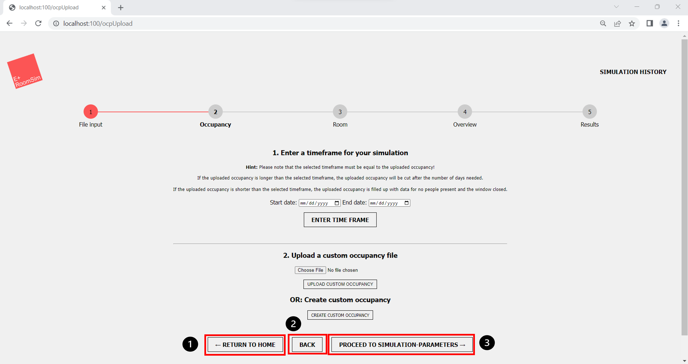
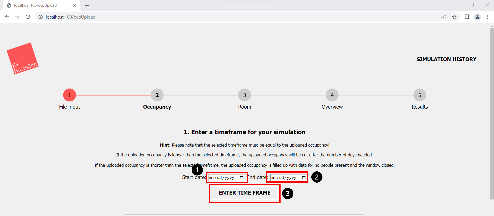

(Author: Katharina Sammet) 
# Occupancy

## Occupancy settings

1. "Return to home" This Button will redirect to the landing page
2. "Back" This button goes back to the previous page "File Input"
3. "Proceed to simulation Parameters" Redirects to the next page "Room Parameters" (only if timeframe and occupancy file are uploaded)

## Set timeframe

1. "Start date":  Set start date for the simulation
2. "End date": Set end date for the simulation
3. "Enter time frame":  Saves timeframe 

1. Showcases the selected and saved timeframe
2. "Delete selected timeframe": To change current timeframe, delete timeframe and enter new one

## Upload custom occupancy file

1. "Choose file": Button will open directory from home computer to choose a file to upload
2. "Upload custom occupancy": After selecting a file, click here to upload file. 

1. This message with the name of the occupancy file will be displayed if it was uploaded successfully.

## Create custom occupancy

1. "Create custom occupancy": Button to change interface for enter custom occupancy

1. "Add row": Add a new row to the table to enter time, occupancy and window information
2. "Back to coosing an occupancy file": Goes back to website to upload a occupancy file. 

1. "Date": Enter Date. Date must match timeframe from above
2. "Start": Start time when people enter room, window is opend or both. 
3. "End": End time when people leave room, close window or both. 
4. "People": Number of people which are in the room during the timeframe in this row
5. "Window": Choose "open Window" or "close Window" depends which applies during the entered timeframe
6. "Delete": Delete this row
7. "Verify Data": Verify Data. Data need to be verified before it can be uploaded
8. "Add row": Add another row to this table
9. "Verification successful!": Confirmation that the verification of the entered data is correct . This message will occur after the user pressed the button "verify data". 

1. "Create Occupancy": After the data was verified in the table click "Create Occupancy" to upload data.
2. "Success - Successfully created a custom occupancy": This message will be display after occupancy was created successfully

1. If the user click "Back to coosing an occupancy file" after a Custom occupancy table was successfuly uplaoded the data is saved in the file "Simulation_OCP.csv". To change this and upload a new file click "choose file", the "Simulation_OCP.csv" file be deleted and a new file is uploaded. 

1. Overview page for simulation data
2. Table with enterd custom occupancy data
