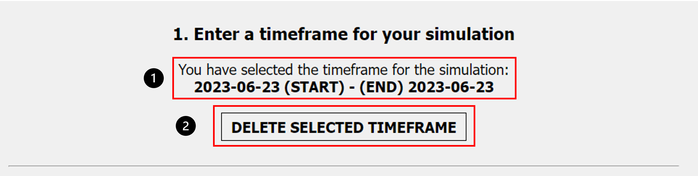

(Author: Katharina Sammet) 
# Occupancy

## Occupancy settings

1. "Return to home" This Button will redirect to the landing page
2. "Back" This button goes back to the previous page "File Input"
3. "Proceed to simulation Parameters" Redirects to the next page "Room Parameters" (only if timeframe and occupancy file are uploaded)

After the idf and epw file are uploaded the next step is to create a timeframe and upload an occupancy of the room. This page let the user set the timeframe and a file with occupany information. With the buttons on the bottom is is possible to navigate to the previous page, back to the landing page and proceed to the next page. To proceed to the next page, the simulation parameter page, all information on this site need to be uploaded or created. It the timeframe or file is missing it is not possible to proceed to the next site. 

## Set timeframe

1. "Start date":  Set start date for the simulation
2. "End date": Set end date for the simulation
3. "Enter time frame":  Saves timeframe

Here the user need to enter a timeframe for the simulation. Be aware that the timeframe should match the occupancy upload. If the timeframe is longer than the occupancy will be filled up with no people and closed windows. If the occupancy is longer than the timeframe the occupancy will be cut of. 

IMPORTANT! It is not possible to simulate a timeframe longer than a year. Is is also only possible to simulate dates within a year. For example, it is not possible to simulate a timeframe from 12.12.2023 - 15.01.2023. This is due to EnergyPlus. EnergyPlus only saved the day and month but not the year for the simulation! The maximal lenght  for a simulation is therefore exactly a year. 

1. Showcases the selected and saved timeframe
2. "Delete selected timeframe": To change current timeframe, delete timeframe and enter new one

## Upload custom occupancy file

1. "Choose file": Button will open directory from home computer to choose a file to upload
2. "Upload custom occupancy": After selecting a file, click here to upload file.

To choose an file use the upload buttons and choose a file fromt the computer. With the "Upload custom occupany" button the file will be uploaded. 

IMPORTANT: The occupany file needs to have a special format. 

The header should look like this.

|day|time|occupants|win1|
|0|00:00:00|0|0|
|0|00:01:00|0|0|
|0|00:02:00|0|0|
|.|........|.|.|
|1|12:05:00|1|1|
|1|12:06:00|2|1|

* Day: The first column contains the day (0 equals day 1, 1 equals day 2, etc.)
* Time: The column time includes every minute of the day
* Occupants: This column provides the number of occupants which are present every minute in the room
* win1: The colum win1 contains 0 or 1, 0 for window closed and 1 for window opend. This information is available for every minute of the day.

An example file for one day can be found [here](https://github.com/KathiSa/indoorclimatesimulation/blob/main/resources/occupancy_1day.csv). 

Another example file with no data for occupants and windows can be found [here](https://github.com/KathiSa/indoorclimatesimulation/blob/main/resources/Base_OCP.csv). 

[Here](https://github.com/KathiSa/indoorclimatesimulation/blob/main/resources/occupancy_7days.csv) can be found an example for 7 days. 

1. This message with the name of the occupancy file will be displayed if it was uploaded successfully.

## Create custom occupancy

1. "Create custom occupancy": Button to change interface for enter custom occupancy

1. "Add row": Add a new row to the table to enter time, occupancy and window information
2. "Back to coosing an occupancy file": Goes back to website to upload a occupancy file. 

1. "Date": Enter Date. Date must match timeframe from above
2. "Start": Start time when people enter room, window is opend or both. 
3. "End": End time when people leave room, close window or both. 
4. "People": Number of people which are in the room during the timeframe in this row
5. "Window": Choose "open Window" or "close Window" depends which applies during the entered timeframe
6. "Delete": Delete this row
7. "Verify Data": Verify Data. Data need to be verified before it can be uploaded
8. "Add row": Add another row to this table
9. "Verification successful!": Confirmation that the verification of the entered data is correct . This message will occur after the user pressed the button "verify data". 

1. "Create Occupancy": After the data was verified in the table click "Create Occupancy" to upload data.
2. "Success - Successfully created a custom occupancy": This message will be display after occupancy was created successfully

1. If the user click "Back to coosing an occupancy file" after a Custom occupancy table was successfuly uplaoded the data is saved in the file "Simulation_OCP.csv". To change this and upload a new file click "choose file", the "Simulation_OCP.csv" file be deleted and a new file is uploaded. 

1. Overview page for simulation data
2. Table with enterd custom occupancy data
