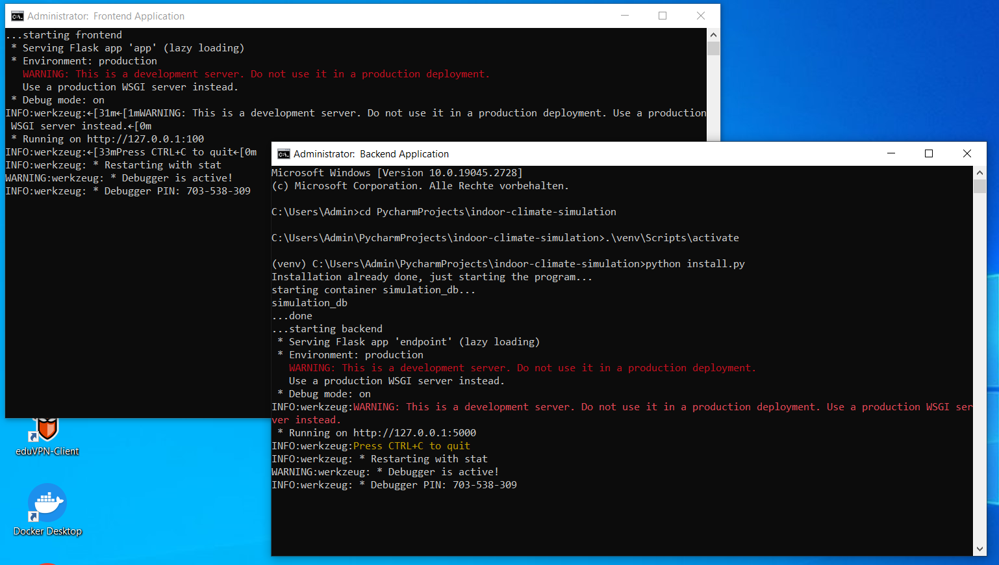

(Author: Sophia Weißenberger) 
# Start Program with Windows

To start the program you have a few different options: 
   * start everything at once
   * start frontend and backend seperately

You can find a step by step guide including pictures below!

## Simple guide for starting everything at once

Open a command window and navigate into you project folder. 

execute the following: 

```
 python install.py
```

Note: You can find a step by step guide including pictures below!

## Simple guide for starting frontend and backend seperately

### Starting backend: 

Open a command window and navigate into you project folder. 

execute the following: 

```
cd backend
```

execute the following: 

```
python -m app
```

Note: You can find a step by step guide including pictures below!

### Starting frontend (optional): 


Open another command window and navigate into you project folder. 

execute the following: 

```
cd frontend
```

execute the following: 

```
python -m app
```

Note: You can find a step by step guide including pictures below!


## Start everything at once (with pictures)

Step 1: Open a new command window.


Step 2: Navigate to the project folder.

(Note: File path in the picture will differ and is only for visualisation purposes!)


Step 3: Run script install.py 

```
 python install.py
```


Step 4: Backend and frontend start automatically

In this step you have to do nothing. If the frontend started successfully another command window should open automatically. 



Step 5: Open [http://localhost:100/](http://localhost:100/) in your browser

You should see the following: 


## Start frontend and backend seperately (with pictures) 

Step 1: Open a new command window.


Step 2: Navigate to the project folder.

(Note: File path in the picture will differ and is only for visualisation purposes!)


Step 3: Start backend 

```
cd backend
```


```
python -m app
```


Step 4 (optional): Start frontend 

Repeat Step 1 and 2: Open a new command window and navigate to the project folder. 

Then 

```
cd frontend
```


```
python -m app
```


# Start Program with Linux

TODO: TODOOOOOOOO 
