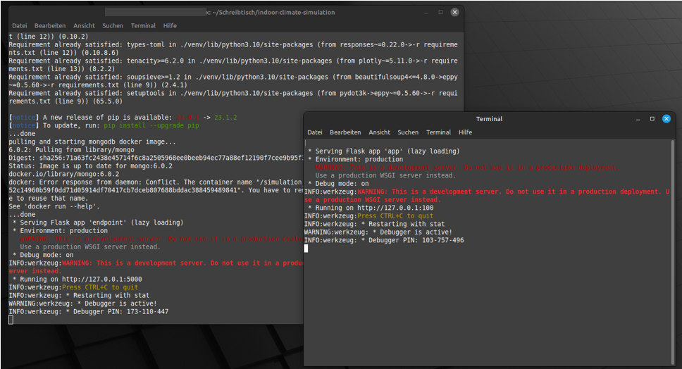

(Author: Sophia Weißenberger) 
# Start Program with Windows

To start the program you have two different options: 
   * start everything at the same time (both frontend and backend)
   * start frontend and backend seperately

You can find a step by step guide including pictures below.

## Simple guide for starting everything at the same time

Open a command window and navigate into your project folder. 

Execute the following: 

```
 python install.py
```

Your backend and frontend has been started. Now you can open [http://localhost:100/](http://localhost:100/) in your browser and use the frontend to run a simulation.

Note: You can find a step by step guide including pictures below.

## Simple guide for starting frontend and backend seperately

### Starting backend: 

Open a command window and navigate into your project folder. 

Execute the following:  

```
cd backend
```

Execute the following:  

```
python -m app
```

Your backend has been started. Now you can use the backend, for example to work with Jupyter Notebooks.

Note: You can find a step by step guide including pictures below.

### Starting frontend (optional): 

Open another command window and navigate into your project folder. 

Execute the following: 

```
cd frontend
```

Execute the following:  

```
python -m app
```

Your frontend has been started. Now you can open [http://localhost:100/](http://localhost:100/) in your browser and use the frontend to run a simulation.

INFORMATION: If you started only the frontend and not the backend, running a simulation will not work! The frontend does not work without the backend!

Note: You can find a step by step guide including pictures below.


### Starting Spider (optional): 

Open another command window and navigate into your project folder. 

Execute the following: 

```
cd ladybug_spider/spider-idf-viewer/v-2020-10-09/
```

Execute the following:  

```
node server.js
```


The Spider server has been started. Now you can open [http://localhost:100/](http://localhost:100/) in your browser and use the frontend to run a simulation and use the frontend functionality to visualise your idf file in the step "Room".

Note: You can find a step by step guide including pictures below.


## Start everything at the same time (with pictures)

Step 1: Open a new command window.


Step 2: Navigate to the project folder.

(Note: File path in the picture will differ and is only for visualisation purposes.)


Step 3: Run script install.py 

Execute the following: 

```
 python install.py
```


Step 4: Backend and frontend start automatically

In this step you have to do nothing. If the frontend started successfully, another command window should open automatically. 


Step 5: Open [http://localhost:100/](http://localhost:100/) in your browser

You should see the following: 


## Start frontend, backend and spider seperately (with pictures) 

Step 1: Open a new command window.


Step 2: Navigate to the project folder.

(Note: File path in the picture will differ and is only for visualisation purposes.)


Step 3: Start backend 

Execute the following: 

```
cd backend
```


Execute the following: 

```
python -m app
```


Your backend has been started. Now you can use the backend, for example to work with Jupyter Notebooks. 

Step 4 (optional): Start frontend 

Repeat Step 1 and 2: Open a new command window and navigate to the project folder. 

Execute the following: 

```
cd frontend
```


Execute the following: 

```
python -m app
```


Your frontend has been started. Now you can open [http://localhost:100/](http://localhost:100/) in your browser and use the frontend to run a simulation. 


Step 5 (optional): Start spider

Repeat Step 1 and 2: Open a new command window and navigate to the project folder. 


Execute the following: 

```
cd ladybug_spider/spider-idf-viewer/v-2020-10-09/
```


Execute the following:  

```
node server.js
```


The Spider server has been started. Now you can open [http://localhost:100/](http://localhost:100/) in your browser and use the frontend to run a simulation and use the frontend functionality to visualise your idf file in the step "Room".


# Start Program with Linux
(Author: Diana Marjanovic)

To start the program you have two different options: 
   * start everything at the same time (both frontend and backend)
   * start frontend and backend seperately

You can find a step by step guide including pictures below.

## Simple guide for starting everything at the same time

Open a command window and navigate into your project folder. 

Execute the following: 

```
 python3 install.py
```

Your backend and frontend has been started. Now you can open [http://localhost:100/](http://localhost:100/) in your browser and use the frontend to run a simulation.

Note: You can find a step by step guide including pictures below.

## Simple guide for starting frontend and backend seperately

### Starting backend: 

Open a command window and navigate into your project folder. 

Execute the following:  

```
cd backend
```

Execute the following:  

```
python3 -m app
```

Your backend has been started.

Note: You can find a step by step guide including pictures below.

### Starting frontend (optional): 

Open another command window and navigate into your project folder. 

Execute the following: 

```
cd frontend
```

Execute the following:  

```
python3 -m app
```

Your frontend has been started. Now you can open [http://localhost:100/](http://localhost:100/) in your browser and use the frontend to run a simulation.

INFORMATION: If you started only the frontend and not the backend, running a simulation will not work! The frontend does not work without the backend!

Note: You can find a step by step guide including pictures below.


## Start everything at the same time (with pictures)

Step 1: Open a new command window.


Step 2: Navigate to the project folder.

(Note: File path in the picture will differ and is only for visualisation purposes.)


Step 3: Run script install.py 

Execute the following: 

```
 python3 install.py
```


Step 4: Backend and frontend start automatically

In this step you have to do nothing. If the frontend started successfully, another command window should open automatically. 




Step 5: Open [http://localhost:100/](http://localhost:100/) in your browser

You should see the following: 


## Start frontendand backend seperately (with pictures) 

Step 1: Open a new command window.


Step 2: Navigate to the project folder.

(Note: File path in the picture will differ and is only for visualisation purposes.)


Step 3: Start backend 

Execute the following: 

```
cd backend
```


Execute the following: 

```
python3 -m app
```


Your backend has been started. 

Step 4 (optional): Start frontend 

Repeat Step 1 and 2: Open a new command window and navigate to the project folder. 

Execute the following: 

```
cd frontend
```


Execute the following: 

```
python3 -m app
```

The result should be like backend!

Your frontend has been started. Now you can open [http://localhost:100/](http://localhost:100/) in your browser and use the frontend to run a simulation. 

