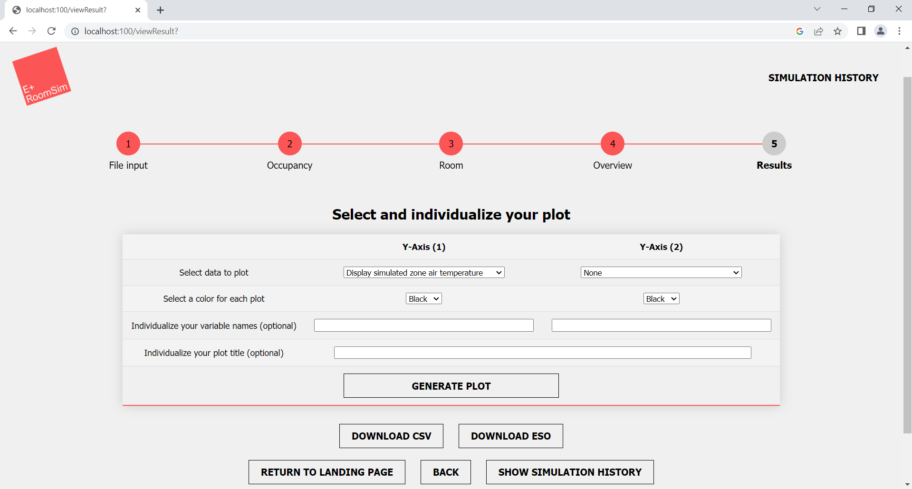
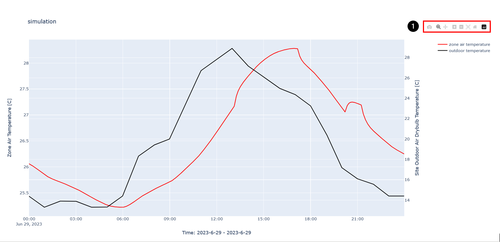
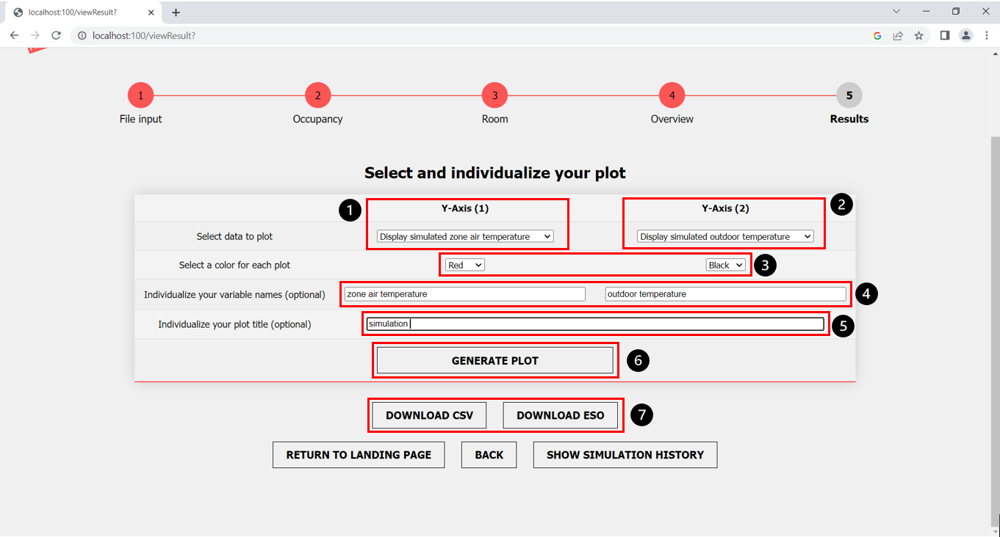

Author: Sophia Weißenberger
# Results

After a successful simulation, you can display several simulated measured values in a graphical representation. Currently, graphs are offered for the following values:

  * Simulated zone air temperature
  * Simulated zone CO2-concentration
  * Simulated zone relative humidity
  * Simulated outdoor temperature
  * Simulated outdoor air pressure 
  * Window openings
  * Occupancy

As soon as you open the results page (View Results) you get a selection screen, on which you have several setting options. We offer you the option to to design the graphs according to your needs. You can select the following:

  * Graph with one or two measured values displayed
     * First measured value is plotted on the Y-axis 1
     * Second measured value is plotted on Y-axis 2
  * Individual colors for each plotted measured value
  * Individual labels for each plotted measured value
  * Individual title for the plotted graph

The graphs you create open in a separate window/browser tab. In this one you can fully interact with the graph you created. Here is a brief overview of the features:

   * Zoom in/out over a specific section
      * Reading of exact values at a certain point in time by means of a label
   * Hide/show the plotted measured values 
   * Creation of a screenshot for the whole graph
   * Creation of a screenshot for a selected section
   * Downloading the plot as png

For easier navigation, all possible interaction are also displayed at the upper right edge of the graph (Fig 2, marker 1).

1. Interaction menu

If you no longer need the graph and want to create a new plot, simply close the newly opened plot window/tab and return to the original results page. Here you have the possibility to again create a completely new plot with different content.

## How to create a plot

Step-by-step instructions for creating individual graphs
1. Select the first measured value (Y-axis (1)) (Fig. 3, marker 1)
2. (Optional) Select a second measured value (Y-Axis (2)) (Fig. 3, marker 2)
3. Select an individual line color for each measured value (Fig. 3, marker 3)
4. (Optional) Give each measured value an individual name (Fig. 3, marker 4)
5. (Optional) Give an individual name to the created graph (Fig. 3, marker 5)
6. Click on the "Generate Plot" button (Fig. 3, marker 6)

## How to download the results

7. Download the simulation results via corresponding buttons as CSV file or ESO file
   
If you want to use the simulated values furthermore yourself, we offer a download of all the data in CSV and ESO format. To do this, click on the "download csv" and "download eso" buttons (Fig. 3, marker 7).

## Proceed
When you have finished creating the graphs, you have three options with the buttons buttons at the bottom of the screen:
   * Return to the landing page (Home) using the "Return to landing page" button.
   * Go a step back using the "Back" button to return to the step before.
   * View the simulation history using the "Show Simulation History" button.
