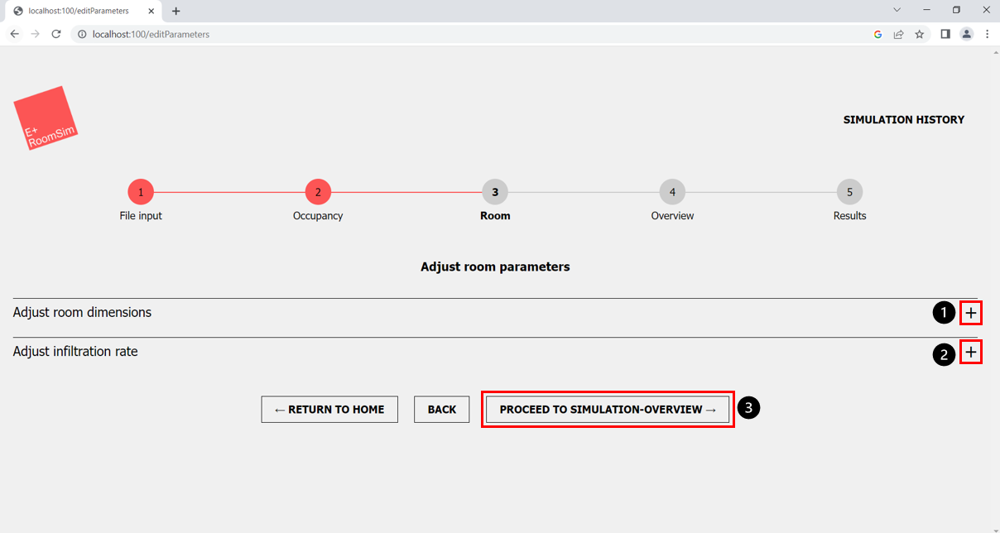
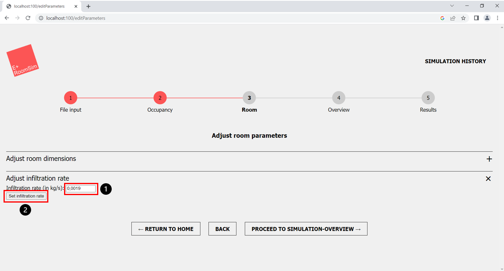
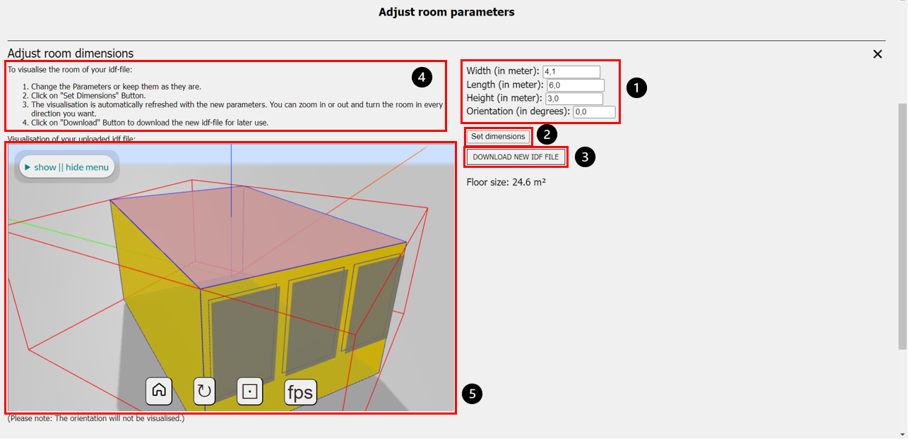

Author: Sophia Weißenberger 
# Room

Now that you have successfully specified the input data as well as the time period and room occupancy, you can make selected adjustments in the IDF file in the following step. It is important to emphasize that these adjustments are not mandatory. If no changes are made, the values in the the IDF file will remain unchanged, or default values will be used and you can move on to the next step (Fig. 1, marker 3).

*Figure 1: Room - adjust room parameters*

1. Open Adjust Room Dimension (+ IDF visualisation)
2. Open Adjust Infiltration Rate
3. Proceed to Simulation-Overview (next step)

   
## Adjust Infiltration Rate

*Figure 2: Room - adjust infiltration rate*

1. Change infiltration rate
2. Confirm new infiltration rate with button
   
Clicking on "Adjust infiltration rate" (Fig. 1, marker 2) opens the input for the desired infiltration rate. Please enter the desired infiltration rate in the field provided (Fig. 2, marker 1). Please note that the entered value must be between 0 and 1. Then confirm the entry via the "Set infiltration rate" button (Fig. 2, marker 2). 

## Adjust Room Dimensions and visualise IDF Room

*Figure 3: Room - adjust room dimensions*

1. Room Parameter
2. Button to confirm new room parameters
3. Button to download the newly created IDF file with the changed room dimensions.
4. Short step-by-step guide for the IDF visualisation
5. Visualisation of the IDF file 

The adjustment of the room parameters is only possible if you have used the base.idf example IDF file in the file upload. If you have uploaded your own IDF file, the room will be visualised but the room dimensions cannot be adjusted, because it could be a more complex building with several rooms. In this case we ask you to upload the IDF file in a dedicated IDF editor and only then upload it to this web application.

If you have the base.idf file in step 1 and now decide to adjust it, this can be done in two easy steps. If you click on the "Adjust room dimensions" field (Fig. 1, marker 1), the menu for adjusting the room parameters shown in (Fig. 3, marker 1) opens. The graphic (Fig. 3, marker 5) on the left side shows the visualisation of the uploaded IDF file and the parameters on the right side (Fig. 3, marker 1) give you information about which parameters you can use to adjust the room to your desired dimensions by means of the labels "Length", "Width" and "Height". "Orientation" can also be adjusted, but will only be used for the simulation and not be visualised. In the next step, please enter your input in the fields provided for this purpose (Fig. 3, marker 1). The room dimensions will then be adjusted in the IDF file and the windows will scale in the same proportion. Please confirm your input by clicking on the "Set dimensions" field (Fig. 3, marker 2). You will see the changed room visualised (Fig. 3, marker 5) and updated with the new parameters and also see the new floor size of the room. After clicking the button "Set dimensions" another button will show up. You can use the "Download new idf file" button to download the newly created IDF file with the changed parameters for later use (Fig. 3, marker 3). 
