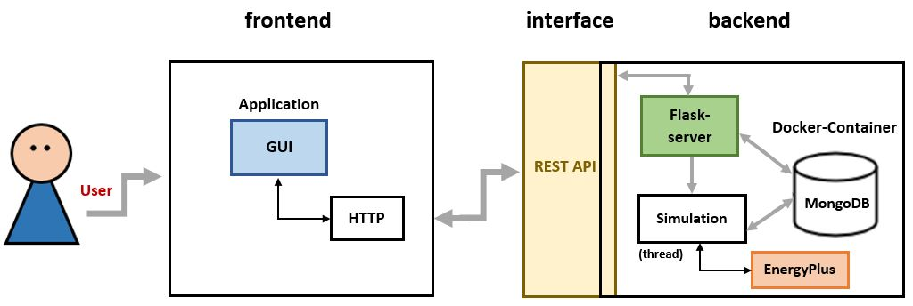
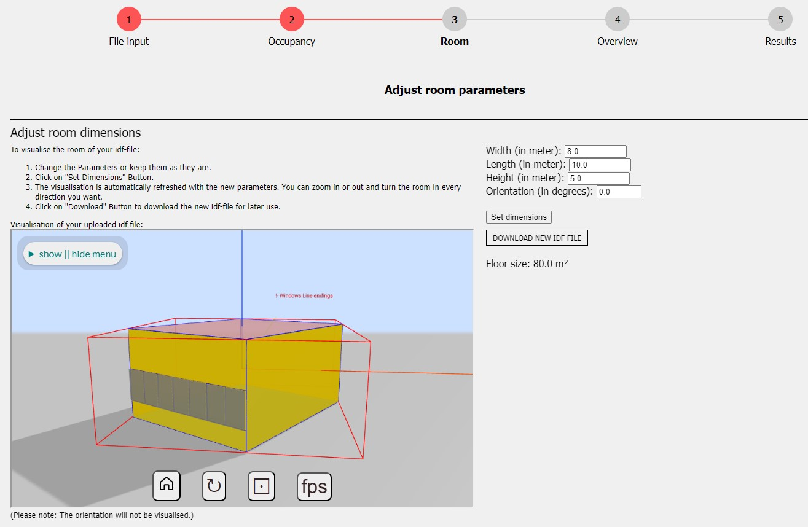

(Author: Sophia Weißenberger) 
# EnergyPlus Room Simulator

This program is intended to simplify the operation of EnergyPlus for the user. For this purpose, an easy-to-use and straightforward GUI is provided. With this GUI it is possible to simulate the indoor climate of a room with individual IDF and EPW files. Furthermore, adjustments can be made to occupancy (presence of people and window openings), room dimensions and infiltration rate. This allows the simulation to be further individualized. Plots of the simulation results can then be displayed, and the simulation results can be downloaded as a CSV file and an ESO file. All inputs and outputs are persistently stored in a NoSQL database (MongoDB).

This documentation provides you with information about the tool EnergyPlus Room Simulator. This tool simulates the indoor climate in rooms. The software “EnergyPlus” is used for the simulation. Additionaly the Python package “eppy” serves as a connector between EnergyPlus and Python.

This program consists of two parts: the frontend and the backend. The frontend includes a web server with a GUI to control the simulation. The backend includes the simulation via the “eppy” Python package. Data of the simulations is saved in an MongoDB instance. The backend provides additional functionalities with a REST API.

*Architecture*

# Introduction
(Author: Diana Marjanovic) 

Nowadays, people spend a lot of time indoors. Be it during work in offices, their leisure time in sports facilities, or at home. Factors that affect the indoor climate include the number of people, the volume of the room, the duration of use, the humidity and CO2 concentration in the air, the ventilation, the indoor and outdoor temperature, and so on. Values for some of these factors can be used to simulate the indoor climate and collect data. Therefore, we have participated in the development of a software system for simulating indoor climate. This software system is called 'EnergyPlus Room Simulator'. With this tool, it is possible to simulate the indoor climate of a specific room. EnergyPlus, an energy simulation program, is used for this purpose. Using our program, on the one hand, the room can be visualized in 3D. On the other hand, old simulation results can be reopened, its configurations can be changed and being started as a new simulation again. Our tool consists of frontend and backend, with a REST API as interface. The data is persisted using a MongoDB database. Among others, the programming languages python, javascript and html/css were also used.

# Motivation
(Author: Diana Marjanovic) 

Our software system, the 'EnergyPlus Room Simulator' tool, provides a user-friendly GUI and allows people without in-depth technical knowledge to execute room climate simulations with EnergyPlus. Our User Interface (see screenshot below) helps step-by-step to quickly create indoor climate simulations. The different options for configuring a simulation as well as the possibility to have the simulation results output for analysis using graphs that can be adjusted to one's requirements show the versatility of our tool.

(Author: Katharina Sammet)

The tool can support science-related tasks like detecting occupancy in building rooms. In [this](https://dl.acm.org/doi/10.1145/3408308.3431124) paper the authors discussed an approach to use machine learning to detect presence and number of people in a room. They proposed that an approach which combines real world data and simulation data can reduce the required training data by half and contribute to a more robust model. Our tool can provide the needed simulation data for this technique and offers users without in-depth, technical knowledge to generate simulations and as well a REST API which can be used to automate simulations. 

*EnergyPlus Room Simulator (Screenshot)*
